## Criando tabela no Dynamo, e realizando querys

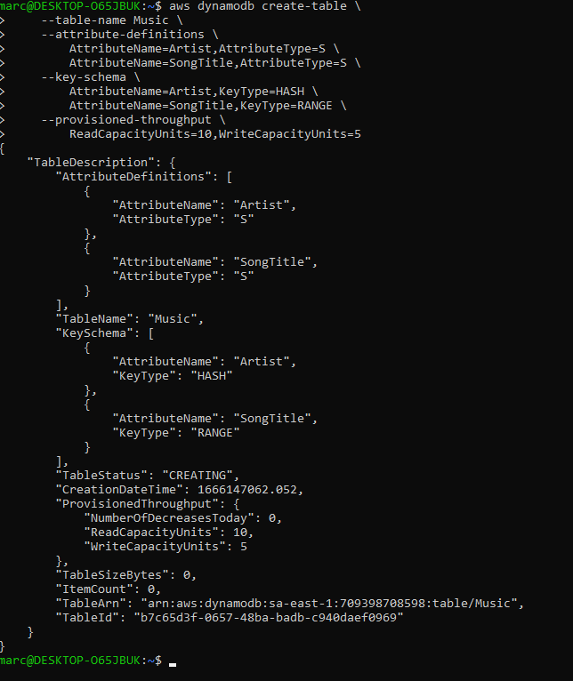

### inserindo um unico item:

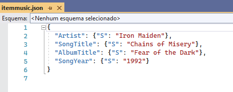

Com o comando, irá inserir o conteúdo do arquivo na tabela:

> aws dynamodb put-item \
>     --table-name Music \
>     --item file://itemmusic.json \

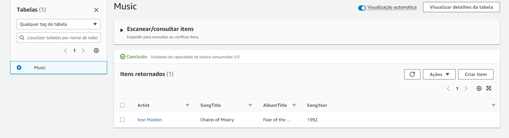

### Inseriremos multiplos itens com o comando:

> aws dynamodb batch-write-item \
>     --request-items file://batchmusic.json

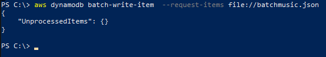

Obteremos o resultado:
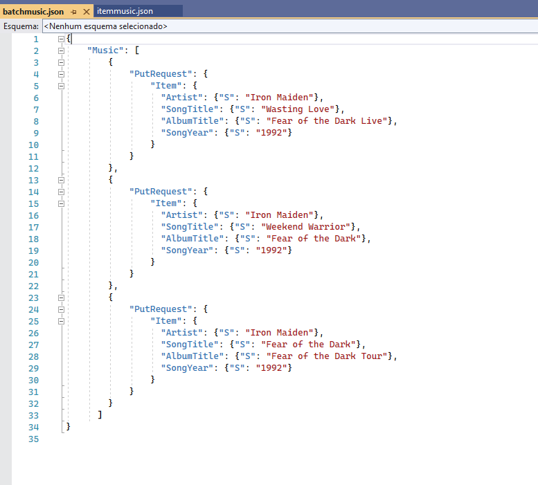

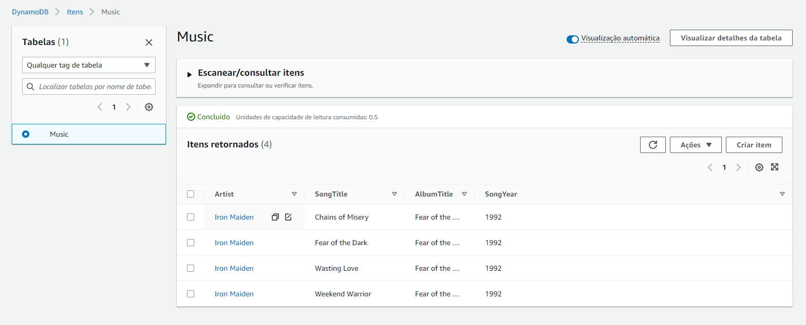

Adicionando indices:

Indíce global secundário baseado no título do álbum.
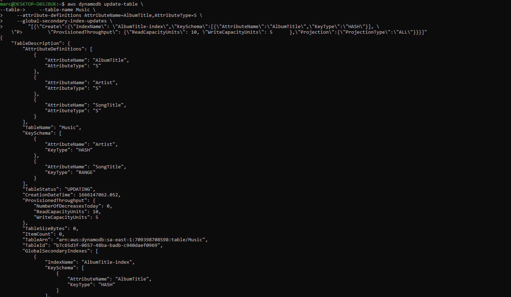

Indíce global secundário baseado no nome do artista e no título do álbum.
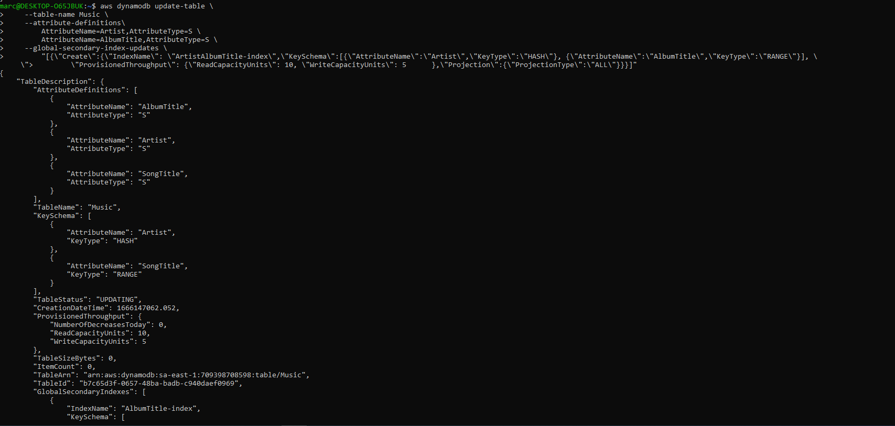

Indíce global secundário baseado no título da música e no ano
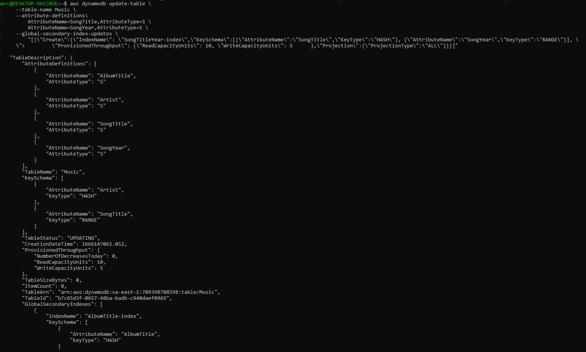

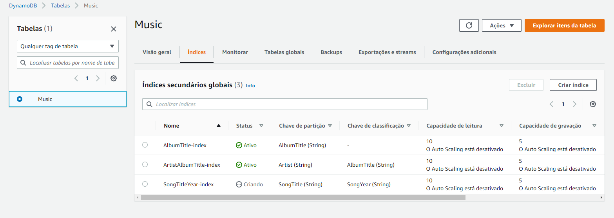

## Visualizando algumas querys:

Pesquisando por artista:

> aws dynamodb query \
>    --table-name Music \
>    --key-condition-expression "Artist = :artist" \
>    --expression-attribute-values  '{":artist":{"S":"Iron Maiden"}}'

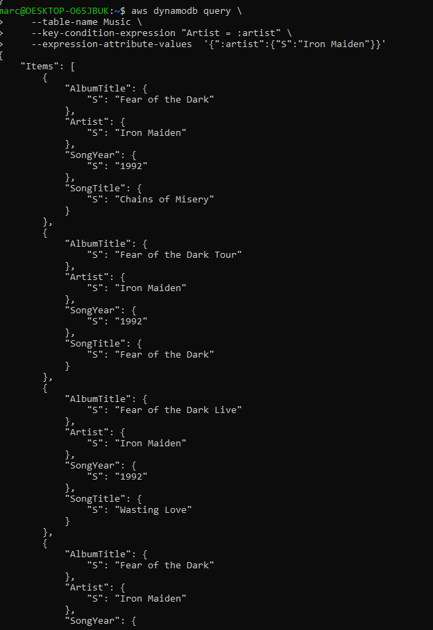

Pesquisa pelo título do album

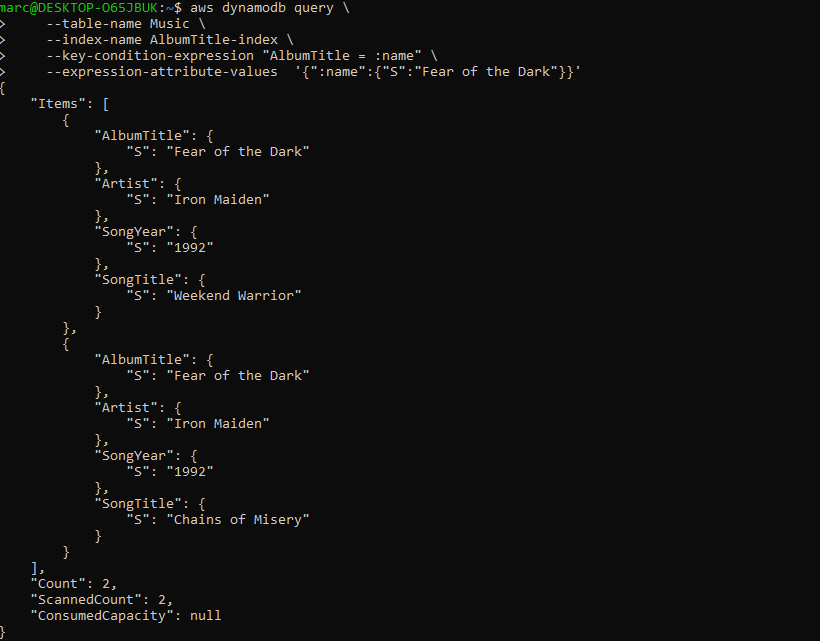

Pesquisa pelo artista e pelo album

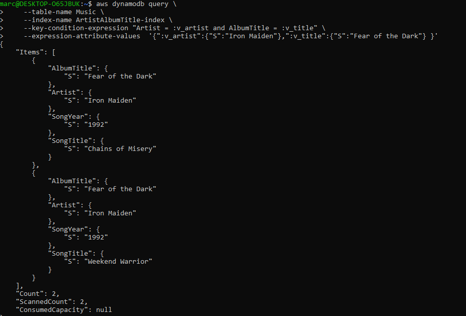

Pesquisa baseada na musica e ano do album

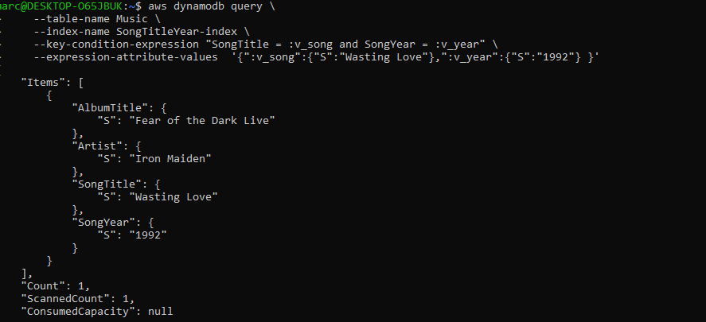